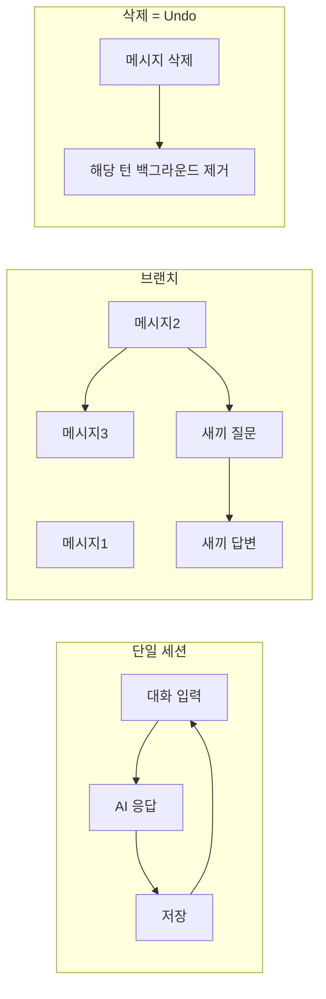
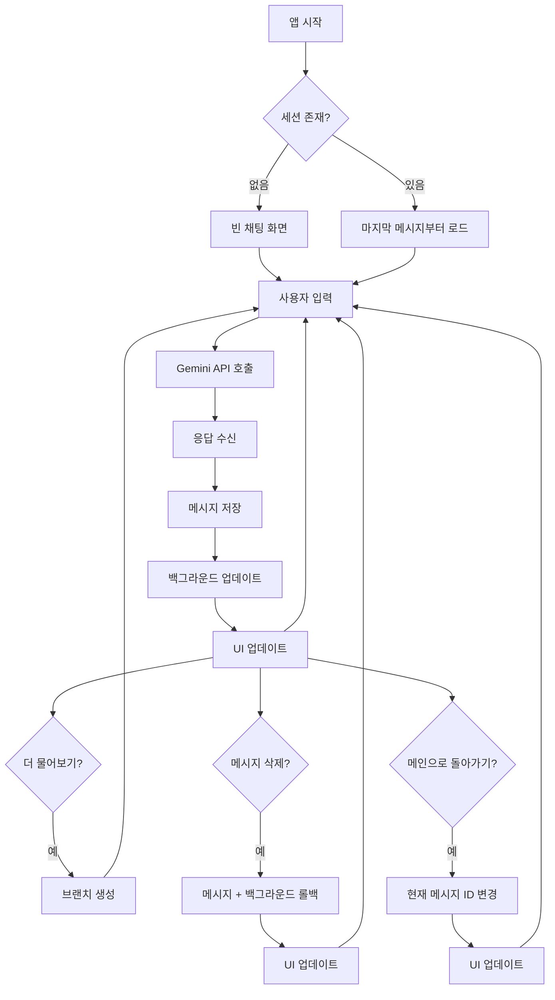

# 나만을 위한 마인드 코치 앱 — 기획서

## 1. 니즈 정리


| 현재 불편함                               | 사용자 니즈                                                           |
| ------------------------------------ | ---------------------------------------------------------------- |
| 메모장 → Gemini 복붙 → 답변 → 노션 복붙으로 시간 소모 | **한 앱에서 바로 대화**: 입력·상담·기록이 한 흐름으로                                |
| 세션 바뀌면 백그라운드/히스토리 초기화                | **단일 세션 + 영구 저장**: 상담 히스토리·백그라운드를 앱이 계속 유지                       |
| 선형 Q&A만 가능, 특정 답변에 대한 새끼 질문 불가       | **브랜치 질문**: 어떤 답변에서든 새 질문을 파서 깊게 탐색, 필요 시 원래 줄기로 복귀              |
| 삭제 시 대화만 지우고 AI 기억은 남음               | **삭제 = 컨텍스트 제거**: 질문/답변 삭제 시 해당 턴이 반영된 백그라운드 정보도 함께 제거(undo 스타일) |
| 웹 Gemini와 다른 품질/일관성                  | **전용 프롬프트 + 저장된 상담 정보 기반 응답**: Gemini 웹 채팅과 동등한 수준의 응답 품질 목표     |


---

## 2. 핵심 요구사항 (기능)

### 2.1 세션·저장

- **단일 채팅 세션**: 여러 세션/채팅방 없음. 하나의 연속된 “나의 상담실”만 존재.
- **매 턴마다 저장**: 사용자 발화 + AI 응답이 발생할 때마다 로컬(또는 선택 시 클라우드) DB에 저장.
- **백그라운드 정보**: “나에 대한 정보”(직업, 관계, 과거 상담에서 드러난 맥락 등)를 턴 단위 또는 주기적으로 갱신·저장하고, 이후 모든 응답 생성 시 참조.

### 2.2 브랜치(새끼 질문)

- **어떤 답변에서든 “여기에 대해 더 물어보기”** 로 새 질문 가능 → 해당 답변을 부모로 하는 **브랜치** 생성.
- **저장 방식**: 브랜치를 구분해 저장해도 되고, “맥락만 유지”하면 된다고 하셨으므로, **플랫 메시지 리스트 + parent_id(또는 thread_id)** 로 “어느 메시지에서 갈래가 났는지”만 알 수 있으면 됨. DB는 단일 타임라인으로 쌓고, “현재 보고 있는 브랜치 경로”만 UI/API에서 관리해도 됨.
- **원래 브랜치로 복귀**: UI에서 “메인 줄기” 또는 특정 메시지로 돌아가기 가능. 그 시점 이후의 메시지들이 현재 컨텍스트에서 제외되거나, “다른 갈래”로 표시되도록.

### 2.3 삭제(Undo)

- **질문 또는 답변 삭제**: 해당 메시지(및 그 아래 브랜치 전체 또는 선택 범위)를 UI에서 삭제.
- **백그라운드 반영**: 삭제된 턴에서 추출·반영된 백그라운드 정보도 함께 제거하거나 롤백. 즉, **삭제 = 그 턴이 없었던 것처럼** 이후 응답에 반영 (Cursor undo와 유사한 느낌).

### 2.4 AI 응답 품질

- **전용 시스템 프롬프트**: “전문 심리상담가” 역할, 경계(위기 시 전문가 연계 등), 톤, 보안 유지 지침을 명시.
- **모든 응답은 “저장된 상담 정보” 기반**:  
  - 현재 컨텍스트(선택된 브랜치 경로 또는 최근 N턴 + 요약)
  - 백그라운드 DB(사용자 프로필·과거 맥락 요약)  
  → Gemini API에 넘겨 응답 생성.
- **목표**: Gemini 웹에서 채팅하는 것과 동일한 수준의 응답 퀄리티(맥락 이해, 일관성, 깊이).

---

## 3. 참고: Gemini / ChatGPT 컨텍스트 관리 방식

- **Gemini API**: stateless. 매 요청마다 `contents` 배열에 **전체 대화 히스토리(chronological)** 를 넣어야 함. 앱이 히스토리 저장·복원 책임. 컨텍스트 윈도우(예: 2.5 Pro 1M 토큰) 초과 시 **앱이** 이전 턴 trim/요약/생략 결정.
- **ChatGPT**: Compaction(자동 압축), 또는 **주기적 요약**(예: 80% 도달 시 이전 대화 요약 후 DB 저장, 이후 요청엔 요약 + 최근 N턴 전달) 등으로 긴 대화 관리.
- **공통 전략**:  
  - 최근 턴은 원문 유지  
  - 오래된 턴은 요약으로 대체  
  - 필요 시 RAG/벡터 검색으로 관련 구간만 검색해 컨텍스트에 포함

→ 본 앱에서도 **“현재 브랜치의 최근 턴 원문 + 이전 턴/다른 브랜치 요약 + 백그라운드 요약”** 조합으로 context를 구성하면, 토큰 한도 내에서 Gemini 웹과 비슷한 품질를 노릴 수 있음.

---

## 4. 기술 방향 (선택 전 제안)

- **클라이언트**: iOS 전용 (Swift/SwiftUI). Xcode 설치·결제 완료 전제.
- **API**: Google Gemini API (사용자 희망: Gemini 3.0 PRO; 실제 배포 시 2.5 Pro 등 사용 가능 모델로 폴백 가능하도록 모델명 설정화).
- **백엔드**:  
  - 1안: **앱 내장만** — 로컬 DB(SQLite/Core Data 또는 SwiftData)에 히스토리·백그라운드 저장, API 키는 앱에 포함(또는 키체인). 기기 한 대 전용.  
  - 2안: **경량 서버** — 히스토리·백그라운드를 서버 DB에 저장, 기기 변경·재설치 시에도 복구 가능.  
  기획 단계에서는 1안으로 시작하고, “동기화/멀티기기”는 이후 확장으로 두는 것이 구현 부담이 적음.
- **컨텍스트 최적화**:  
  - 매 턴 또는 N턴마다 “대화 요약” + “백그라운드 업데이트”를 저장.  
  - API 호출 시: 시스템 프롬프트 + (백그라운드 요약 + 현재 브랜치의 최근 원문 턴 + 필요 시 이전 요약) 조합.  
  - 토큰 임계치(예: 컨텍스트 80%) 도달 시 자동으로 오래된 턴 요약화 또는 생략.

---

## 5. 데이터 모델 (개념)

- **Message**: `id`, `role`(user/model), `content`, `parent_id`(nullable, 브랜치 부모), `created_at`, `branch_id`(선택, 같은 갈래 묶음).
- **Background**: `id`, `user_id`, `summary_text`(또는 구조화 필드), `source_turn_ids`(이 요약이 반영한 턴들), `updated_at`. 삭제 시 해당 턴을 참조하는 백그라운드 버전을 제거/롤백.
- **Session**: 단일 행. `current_branch_path`(현재 보고 있는 메시지 체인) 또는 “현재 메시지 id”만 저장해도 됨.

브랜치를 “DB에서 완전히 다른 트리”로 두지 않고, **메시지에 parent_id만 두고**, “현재 컨텍스트”를 “root → … → 현재 메시지” 경로로 계산하면, “다른 브랜치와 구분 없이 DB에 저장”하면서도 맥락 유지 가능.

---

## 6. UX 요약




- **단일 세션**: 앱 열면 항상 같은 연속 대화.
- **브랜치**: 답변 옆 “여기서 더 물어보기” → 새 질문/답변 → 필요 시 “메인으로 돌아가기”.
- **삭제**: 메시지 삭제 시 해당 턴이 반영된 백그라운드까지 함께 제거.

---

## 7. 구현 시 우선순위 제안

1. **Phase 1**: 단일 세션 채팅 + 로컬 저장 + Gemini API 연동 + 고정 시스템 프롬프트(상담가 역할).
2. **Phase 2**: 백그라운드 추출·저장·조회 로직(매 턴 또는 N턴마다 요약/업데이트) + API 호출 시 백그라운드 포함.
3. **Phase 3**: 브랜치 UI 및 데이터 모델(parent_id, 현재 경로) + “여기서 더 물어보기” / “메인으로 돌아가기”.
4. **Phase 4**: 삭제(메시지 + 해당 턴 백그라운드 제거) + 컨텍스트 윈도우 최적화(요약/trim 로직).
5. **Phase 5**(선택): 클라우드 동기화, 다기기 지원.

---

## 8. 확인이 있으면 좋은 점

- **Gemini 3.0 PRO**: 현재 공개 API에서는 2.5 Pro 등이 일반적일 수 있음. 실제 구현 시 `gemini-2.5-pro` 또는 사용 가능한 최신 Pro 모델 사용.
- **백엔드**: 앱 내장만 사용 (로컬 DB). API 키는 Keychain에 저장.
- **브랜치 저장**: parent_id 기반 플랫 리스트 + "현재 경로"만 관리하는 방안으로 구현.

---

## 9. API 스펙 초안

### 9.1 Gemini API 엔드포인트

**기본 엔드포인트:**

```
POST https://generativelanguage.googleapis.com/v1beta/models/{model}:generateContent
```

**사용 모델:**

- 우선순위: `gemini-2.5-pro` (또는 사용 가능한 최신 Pro 모델)
- 폴백: `gemini-2.0-flash-exp` (빠른 응답이 필요한 경우)
- 모델명은 설정 가능하도록 구성

**인증:**

- API Key: `{YOUR_API_KEY}` (환경변수 `GEMINI_API_KEY` 또는 Keychain에서 로드)
- 헤더: `x-goog-api-key: {API_KEY}`
- API 키는 Keychain에 저장하여 보안 강화
- **주의**: API 키는 절대 코드나 문서에 하드코딩하지 마세요

### 9.2 요청 형식

**기본 요청 구조:**

```json
{
  "contents": [
    {
      "role": "user",
      "parts": [{"text": "사용자 메시지"}]
    },
    {
      "role": "model",
      "parts": [{"text": "AI 응답"}]
    },
    {
      "role": "user",
      "parts": [{"text": "현재 사용자 메시지"}]
    }
  ],
  "systemInstruction": {
    "parts": [{"text": "{시스템 프롬프트 + 백그라운드 정보}"}]
  },
  "generationConfig": {
    "temperature": 0.7,
    "topK": 40,
    "topP": 0.95,
    "maxOutputTokens": 8192
  }
}
```

**시스템 프롬프트 (전문 심리상담가 역할):**

```
당신은 전문적인 심리상담가입니다. 다음 원칙을 따르세요:

1. 역할: 사용자의 마음 상태를 깊이 이해하고, 공감적이고 지지적인 상담을 제공합니다.
2. 톤: 따뜻하고, 비판적이지 않으며, 사용자가 자신의 감정을 탐색할 수 있도록 돕습니다.
3. 경계: 
   - 자해/타해 위험이 감지되면 즉시 전문가(정신건강 전문의, 자살예방전화 1393 등) 연계를 권고합니다.
   - 의학적 진단이나 처방은 제공하지 않습니다.
   - 법적 조언은 제공하지 않습니다.
4. 접근법:
   - 사용자의 감정을 먼저 인정하고 검증합니다.
   - 개방형 질문을 통해 사용자가 자신의 상황을 더 깊이 탐색할 수 있도록 돕습니다.
   - 해결책을 강요하지 않고, 사용자가 자신의 해결책을 찾도록 돕습니다.
5. 맥락 활용: 아래 제공된 사용자 백그라운드 정보를 참고하여, 일관성 있고 개인화된 상담을 제공합니다.

=== 사용자 백그라운드 정보 ===
{백그라운드 요약 텍스트}
```

### 9.3 컨텍스트 구성 로직

**컨텍스트 빌더 알고리즘:**

1. **현재 브랜치 경로 추출**
  - `currentMessageId`에서 시작하여 `parent_id`를 역추적하여 root까지 경로 구성
  - 경로상의 모든 메시지를 시간순으로 수집
2. **최근 턴 원문 포함**
  - 현재 브랜치 경로의 최근 N턴(예: 10턴)은 원문 그대로 포함
3. **이전 턴 요약 포함**
  - N턴 이전의 메시지들은 `ConversationSummary`에서 요약본 사용
  - 요약이 없으면 생성 (백그라운드 업데이트 시점에 함께 생성)
4. **백그라운드 정보 포함**
  - `Background` 엔티티의 최신 `summaryText`를 시스템 프롬프트에 포함
5. **토큰 수 계산 및 최적화**
  - 예상 토큰 수가 임계치(예: 800K 토큰)를 초과하면:
    - 오래된 턴부터 요약으로 대체
    - 또는 오래된 턴 제거 (최소한 최근 5턴은 유지)

### 9.4 응답 처리

**응답 형식:**

```json
{
  "candidates": [
    {
      "content": {
        "parts": [{"text": "AI 응답 텍스트"}],
        "role": "model"
      },
      "finishReason": "STOP",
      "safetyRatings": [...]
    }
  ],
  "usageMetadata": {
    "promptTokenCount": 1234,
    "candidatesTokenCount": 567,
    "totalTokenCount": 1801
  }
}
```

**스트리밍 지원 (선택):**

- `streamGenerateContent` 엔드포인트 사용
- 실시간 응답 표시로 UX 개선

### 9.5 에러 처리

- **429 (Rate Limit)**: 재시도 로직 (exponential backoff)
- **400 (Bad Request)**: 요청 형식 검증 및 로깅
- **401 (Unauthorized)**: API 키 확인
- **500 (Server Error)**: 재시도 후 사용자에게 알림

---

## 10. DB 스키마 (SwiftData)

### 10.1 데이터 모델 설계

**Message 엔티티:**

```swift
@Model
final class Message {
    @Attribute(.unique) var id: UUID
    var role: MessageRole  // user, model
    var content: String
    var parentId: UUID?  // 브랜치 부모 메시지 ID (nullable)
    var createdAt: Date
    var isDeleted: Bool  // 삭제 표시 (soft delete)
    
    // 관계
    @Relationship(deleteRule: .cascade) var children: [Message]?  // 자식 메시지들
    var parent: Message?  // 부모 메시지
    
    init(id: UUID = UUID(), role: MessageRole, content: String, parentId: UUID? = nil) {
        self.id = id
        self.role = role
        self.content = content
        self.parentId = parentId
        self.createdAt = Date()
        self.isDeleted = false
    }
}

enum MessageRole: String, Codable {
    case user
    case model
}
```

**Background 엔티티:**

```swift
@Model
final class Background {
    @Attribute(.unique) var id: UUID
    var summaryText: String  // 사용자 백그라운드 요약
    var sourceMessageIds: [UUID]  // 이 요약이 반영한 메시지 ID들
    var updatedAt: Date
    var version: Int  // 버전 관리 (삭제 시 롤백용)
    
    init(id: UUID = UUID(), summaryText: String, sourceMessageIds: [UUID] = []) {
        self.id = id
        self.summaryText = summaryText
        self.sourceMessageIds = sourceMessageIds
        self.updatedAt = Date()
        self.version = 1
    }
}
```

**ConversationSummary 엔티티:**

```swift
@Model
final class ConversationSummary {
    @Attribute(.unique) var id: UUID
    var summaryText: String  // 대화 요약
    var startMessageId: UUID  // 요약 시작 메시지 ID
    var endMessageId: UUID  // 요약 종료 메시지 ID
    var messageIds: [UUID]  // 요약에 포함된 모든 메시지 ID
    var createdAt: Date
    
    init(id: UUID = UUID(), summaryText: String, startMessageId: UUID, endMessageId: UUID, messageIds: [UUID]) {
        self.id = id
        self.summaryText = summaryText
        self.startMessageId = startMessageId
        self.endMessageId = endMessageId
        self.messageIds = messageIds
        self.createdAt = Date()
    }
}
```

**Session 엔티티 (단일 인스턴스):**

```swift
@Model
final class Session {
    @Attribute(.unique) var id: UUID
    var currentMessageId: UUID?  // 현재 보고 있는 메시지 ID (브랜치 경로의 끝)
    var createdAt: Date
    var updatedAt: Date
    
    init(id: UUID = UUID()) {
        self.id = id
        self.createdAt = Date()
        self.updatedAt = Date()
    }
}
```

### 10.2 인덱스 및 쿼리 최적화

- `Message.createdAt` 인덱스: 시간순 정렬
- `Message.parentId` 인덱스: 브랜치 조회
- `Message.isDeleted` 인덱스: 삭제 필터링
- `Background.updatedAt` 인덱스: 최신 백그라운드 조회

### 10.3 데이터 마이그레이션 전략

- SwiftData는 자동 마이그레이션 지원
- 버전 관리: `ModelConfiguration`에서 스키마 버전 지정
- 백그라운드 롤백: `version` 필드로 이전 버전 복원 가능

---

## 11. iOS 화면 목업/플로우

### 11.1 화면 구성

**메인 채팅 화면 (ChatView):**

```
┌─────────────────────────────┐
│  [설정]  마인드 코치  [삭제] │  ← NavigationBar
├─────────────────────────────┤
│                             │
│  [AI 메시지 버블]            │  ← LazyVStack (역순)
│      [더 물어보기 버튼]      │
│                             │
│              [사용자 버블]   │
│                             │
│  [AI 메시지 버블]            │
│      [더 물어보기 버튼]      │
│                             │
│              [사용자 버블]   │
│                             │
├─────────────────────────────┤
│ [브랜치 표시] ← 메인으로     │  ← 현재 브랜치 경로 표시
├─────────────────────────────┤
│ [입력창]        [전송 버튼]  │  ← TextField + Button
└─────────────────────────────┘
```

**브랜치 네비게이션 UI:**

- 현재 브랜치가 메인이 아닐 때 상단에 "← 메인으로 돌아가기" 버튼 표시
- 메시지 버블 옆에 "더 물어보기" 버튼 (AI 응답에만 표시)
- 브랜치 깊이를 시각적으로 표시 (들여쓰기 또는 연결선)

**삭제 UI:**

- 메시지 길게 누르기 (Long Press) → 삭제 옵션 표시
- 삭제 확인 다이얼로그: "이 메시지와 하위 브랜치를 모두 삭제하시겠습니까?"
- 삭제 후 Undo 토스트 (3초간) → 취소 가능

### 11.2 화면 플로우




### 11.3 SwiftUI 컴포넌트 구조

```
ChatView (메인 화면)
├── ChatMessageList (LazyVStack)
│   ├── MessageBubble (user)
│   └── MessageBubble (model)
│       └── BranchButton ("더 물어보기")
├── BranchIndicator (현재 브랜치 표시)
└── MessageInputBar
    ├── TextField
    └── SendButton

Supporting Views:
├── SettingsView (설정 화면)
├── DeleteConfirmationDialog
└── UndoToast
```

### 11.4 상태 관리

- `@Observable` 또는 `@StateObject`로 채팅 상태 관리
- SwiftData `@Query`로 메시지 리스트 자동 업데이트
- `@Environment(\.modelContext)`로 DB 작업

---

## 12. 구현 단계별 상세 계획

### Phase 1: 기본 채팅 기능

**목표:** 단일 세션 채팅 + 로컬 저장 + Gemini API 연동

**작업 항목:**

1. **프로젝트 설정**
  - Xcode 프로젝트 생성 (iOS 17+ 타겟)
  - SwiftData 설정
  - API 키 관리 (Keychain 또는 Config 파일)
2. **데이터 모델 구현**
  - `Message`, `Session` 엔티티 생성
  - SwiftData 모델 컨텍스트 설정
3. **Gemini API 클라이언트**
  - `GeminiAPIService` 클래스 생성
  - REST API 호출 로직 (URLSession)
  - 요청/응답 파싱
  - 기본 에러 처리
4. **시스템 프롬프트**
  - 상담가 역할 프롬프트 상수 정의
  - 요청 시 시스템 프롬프트 포함
5. **기본 UI**
  - `ChatView` 생성
  - `MessageBubble` 컴포넌트
  - `MessageInputBar` 컴포넌트
  - 메시지 리스트 표시 (LazyVStack)
6. **통합**
  - 사용자 입력 → API 호출 → 응답 저장 → UI 업데이트 플로우
  - 세션 초기화 및 복원 로직

**검증 기준:**

- 사용자가 메시지를 입력하고 AI 응답을 받을 수 있음
- 메시지가 로컬 DB에 저장됨
- 앱을 재시작해도 이전 대화가 복원됨

---

### Phase 2: 백그라운드 관리

**목표:** 백그라운드 추출·저장·조회 + API 호출 시 포함

**작업 항목:**

1. **백그라운드 엔티티 구현**
  - `Background` 엔티티 생성
  - `ConversationSummary` 엔티티 생성 (선택)
2. **백그라운드 추출 로직**
  - `BackgroundExtractor` 서비스 생성
  - 매 N턴(예: 5턴)마다 또는 사용자 요청 시 백그라운드 업데이트
  - Gemini API를 사용하여 대화 요약 생성:

```
     "다음 대화를 읽고, 사용자에 대한 중요한 정보(직업, 관계, 감정 상태, 주요 고민 등)를 요약해주세요. 
     이전 백그라운드 정보와 병합하여 업데이트된 요약을 제공하세요.
     
     이전 백그라운드: {기존 summaryText}
     
     최근 대화:
     {최근 N턴 메시지들}"
     

```

1. **백그라운드 저장**
  - 새 백그라운드 생성 시 이전 버전 유지 (version 관리)
  - `sourceMessageIds`에 관련 메시지 ID 저장
2. **API 호출 시 백그라운드 포함**
  - `ContextBuilder` 서비스 생성
  - 최신 백그라운드를 시스템 프롬프트에 포함
  - `GeminiAPIService`에서 컨텍스트 빌더 사용
3. **UI 개선**
  - 백그라운드 업데이트 진행 표시 (선택)
  - 설정 화면에서 백그라운드 확인 가능 (디버그용)

**검증 기준:**

- 백그라운드가 주기적으로 업데이트됨
- API 호출 시 백그라운드가 포함됨
- AI 응답이 이전 대화 맥락을 기억함

---

### Phase 3: 브랜치 기능

**목표:** 브랜치 UI 및 데이터 모델 + "더 물어보기" / "메인으로 돌아가기"

**작업 항목:**

1. **데이터 모델 확장**
  - `Message.parentId` 필드 활용
  - 브랜치 경로 계산 로직 (`getBranchPath(from:to:)`)
2. **브랜치 생성 로직**
  - "더 물어보기" 버튼 클릭 시:
    - 선택된 메시지를 부모로 하는 새 메시지 입력 모드
    - `parentId` 설정하여 메시지 저장
3. **브랜치 경로 관리**
  - `Session.currentMessageId` 업데이트
  - 현재 브랜치 경로 계산 및 표시
4. **컨텍스트 빌더 확장**
  - 현재 브랜치 경로만 포함하도록 수정
  - `parentId`를 역추적하여 경로 구성
5. **UI 구현**
  - `BranchButton` 컴포넌트 (AI 메시지에만 표시)
  - `BranchIndicator` 컴포넌트 (현재 브랜치 표시)
  - "메인으로 돌아가기" 버튼
  - 브랜치 시각화 (들여쓰기 또는 연결선)
6. **네비게이션**
  - 브랜치 간 이동 로직
  - 메인 줄기로 복귀 로직

**검증 기준:**

- AI 응답에서 "더 물어보기" 버튼 표시
- 브랜치 질문 생성 및 답변 가능
- 메인 줄기로 복귀 가능
- 브랜치 경로가 올바르게 표시됨

---

### Phase 4: 삭제 및 컨텍스트 최적화

**목표:** 삭제 기능 + 백그라운드 롤백 + 컨텍스트 윈도우 최적화

**작업 항목:**

1. **삭제 로직**
  - `Message.isDeleted` 플래그 사용 (soft delete)
  - 하위 브랜치 재귀적 삭제
  - UI에서 삭제된 메시지 숨김
2. **백그라운드 롤백**
  - 삭제된 메시지의 `sourceMessageIds`를 포함하는 백그라운드 찾기
  - 해당 메시지들을 제외한 새 백그라운드 생성
  - 또는 이전 버전으로 롤백
3. **Undo 기능**
  - 삭제 후 3초간 Undo 토스트 표시
  - Undo 시 `isDeleted = false` 및 백그라운드 복원
4. **컨텍스트 최적화**
  - 토큰 수 추정 로직 (대략적: 1 토큰 ≈ 4 문자)
  - 임계치(800K 토큰) 도달 시:
    - 오래된 턴 요약 생성 (`ConversationSummary`)
    - 요약으로 대체하여 컨텍스트 구성
5. **요약 생성 로직**
  - 주기적으로 오래된 메시지 요약 생성
  - Gemini API 사용:

```
     "다음 대화를 간결하게 요약해주세요. 중요한 정보와 맥락을 유지하세요.
     
     {요약할 메시지들}"
     

```

1. **UI 개선**
  - 메시지 길게 누르기 → 삭제 옵션
  - 삭제 확인 다이얼로그
  - Undo 토스트

**검증 기준:**

- 메시지 삭제 가능
- 삭제 시 하위 브랜치도 함께 삭제됨
- 백그라운드가 롤백됨
- Undo로 복원 가능
- 긴 대화에서도 컨텍스트가 최적화됨

---

### Phase 5: 테스트 및 최적화

**목표:** 전체 기능 테스트 + 성능 최적화 + 버그 수정

**작업 항목:**

1. **기능 테스트**
  - 모든 Phase의 기능 동작 확인
  - 엣지 케이스 테스트 (빈 메시지, 네트워크 오류 등)
2. **성능 최적화**
  - 메시지 리스트 렌더링 최적화
  - DB 쿼리 최적화 (인덱스 확인)
  - API 호출 최적화 (캐싱, 배치 처리)
3. **에러 처리 강화**
  - 네트워크 오류 처리
  - API 에러 처리
  - DB 에러 처리
4. **UI/UX 개선**
  - 로딩 인디케이터
  - 에러 메시지 표시
  - 애니메이션 추가
5. **문서화**
  - 코드 주석
  - 사용자 가이드 (선택)

---

## 13. 재검토 체크리스트

구현 완료 후 다음 항목들을 일일이 확인하여 완벽히 구현되었는지 검증합니다.

### 13.1 핵심 기능 검증

- **단일 세션**
  - 앱을 열면 항상 같은 연속된 대화가 표시됨
  - 여러 세션/채팅방이 생성되지 않음
  - 세션 정보가 로컬 DB에 저장됨
- **메시지 저장**
  - 사용자 메시지가 즉시 DB에 저장됨
  - AI 응답이 즉시 DB에 저장됨
  - 앱 재시작 후 모든 메시지가 복원됨
- **백그라운드 관리**
  - 백그라운드가 주기적으로 업데이트됨
  - 백그라운드가 API 호출 시 포함됨
  - AI 응답이 이전 대화 맥락을 기억함
  - 백그라운드 버전 관리가 작동함
- **브랜치 기능**
  - AI 응답에 "더 물어보기" 버튼이 표시됨
  - 브랜치 질문을 생성할 수 있음
  - 브랜치 경로가 올바르게 계산됨
  - 메인 줄기로 복귀 가능함
  - 브랜치 시각화가 명확함
- **삭제 기능**
  - 메시지를 삭제할 수 있음
  - 하위 브랜치도 함께 삭제됨
  - 삭제 시 백그라운드가 롤백됨
  - Undo로 복원 가능함
  - 삭제 후 AI 응답에 반영됨 (해당 턴이 없었던 것처럼)
- **AI 응답 품질**
  - 시스템 프롬프트가 올바르게 적용됨
  - 상담가 역할을 일관되게 수행함
  - 백그라운드 정보를 활용함
  - 맥락을 정확히 이해함
  - Gemini 웹과 유사한 품질 수준

### 13.2 기술적 검증

- **API 연동**
  - Gemini API 호출이 정상 작동함
  - 인증이 올바르게 처리됨
  - 요청 형식이 올바름
  - 응답 파싱이 정상 작동함
  - 에러 처리가 적절함
- **데이터베이스**
  - SwiftData 모델이 올바르게 정의됨
  - 메시지 CRUD 작업이 정상 작동함
  - 관계(부모-자식)가 올바르게 설정됨
  - 쿼리 성능이 적절함
  - 데이터 마이그레이션이 작동함
- **컨텍스트 관리**
  - 컨텍스트 빌더가 올바르게 작동함
  - 브랜치 경로가 올바르게 계산됨
  - 토큰 수 추정이 적절함
  - 컨텍스트 최적화가 작동함
  - 요약 생성이 정상 작동함
- **UI/UX**
  - 메시지 리스트가 올바르게 표시됨
  - 스크롤이 부드럽게 작동함
  - 입력창이 올바르게 작동함
  - 버튼들이 올바르게 작동함
  - 로딩 상태가 표시됨
  - 에러 메시지가 표시됨

### 13.3 엣지 케이스 검증

- **네트워크 오류**
  - 오프라인 상태에서 적절한 메시지 표시
  - 네트워크 복구 후 재시도 가능
- **API 에러**
  - Rate Limit 처리
  - 서버 에러 처리
  - 잘못된 요청 처리
- **데이터 무결성**
  - 빈 메시지 처리
  - 매우 긴 메시지 처리
  - 특수 문자 처리
  - 동시성 문제 없음
- **브랜치 엣지 케이스**
  - 루트 메시지에서 브랜치 생성
  - 깊은 브랜치 (10단계 이상)
  - 브랜치에서 브랜치 생성
  - 삭제된 메시지의 브랜치 처리
- **삭제 엣지 케이스**
  - 루트 메시지 삭제
  - 모든 메시지 삭제
  - 삭제 후 즉시 새 메시지 입력
  - Undo 후 재삭제

### 13.4 성능 검증

- **응답 시간**
  - API 호출 응답 시간이 적절함 (< 5초)
  - UI 업데이트가 즉시 반영됨
  - DB 쿼리가 빠름
- **메모리 사용**
  - 메모리 누수 없음
  - 대량 메시지에서도 안정적
- **배터리 사용**
  - 백그라운드 작업이 효율적
  - 불필요한 API 호출 없음

### 13.5 사용자 경험 검증

- **직관성**
  - 기능이 직관적으로 사용 가능
  - UI가 명확함
  - 오류 메시지가 이해하기 쉬움
- **일관성**
  - 디자인이 일관됨
  - 동작이 예측 가능함
  - 상태가 명확함
- **접근성**
  - VoiceOver 지원 (선택)
  - 다크 모드 지원 (선택)
  - 다양한 화면 크기 지원

---

## 14. 추가 고려사항

### 14.1 보안

- API 키는 Keychain에 저장 (하드코딩 방지)
- 사용자 데이터는 로컬에만 저장 (프라이버시)
- 네트워크 통신은 HTTPS만 사용

### 14.2 향후 확장 가능성

- 클라우드 동기화 (iCloud 또는 자체 서버)
- 다기기 지원
- 대화 내보내기 (텍스트 파일, PDF)
- 통계 및 인사이트 (감정 추이 등)

### 14.3 모니터링 및 로깅

- API 호출 로그 (디버그용)
- 에러 로그
- 성능 메트릭 (선택)

---

이 기획서를 기준으로 구현을 진행하고, 각 Phase 완료 시 해당 섹션의 검증 기준을 확인하며, 최종적으로 재검토 체크리스트를 통해 완벽한 구현을 검증합니다.